# React Native Food Recipe App

Developed a feature-rich food recipe application using React Native. The app offers an intuitive and delightful experience, enabling users to discover recipes, view detailed guides, and enhance their cooking with video tutorials.

## Key Features
- **User Authentication**: Secure Sign-In and Sign-Up functionality for seamless access.
- **Recipe Discovery**: Browse recipes across diverse categories with ease.
- **Detailed Guides**: View complete ingredient lists and step-by-step instructions for each recipe.
- **Video Tutorials**: Integrated YouTube tutorials to provide enhanced engagement and better cooking experiences.

### Screenshots

    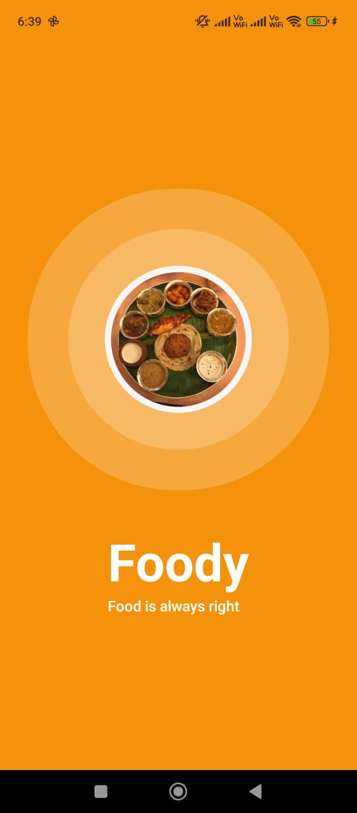
     
    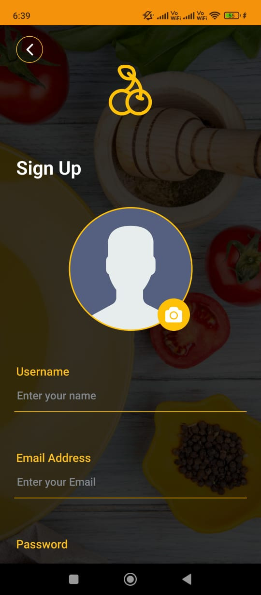
     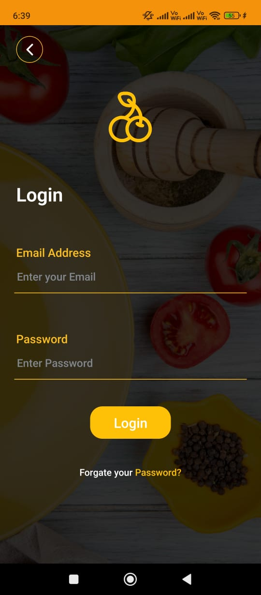
    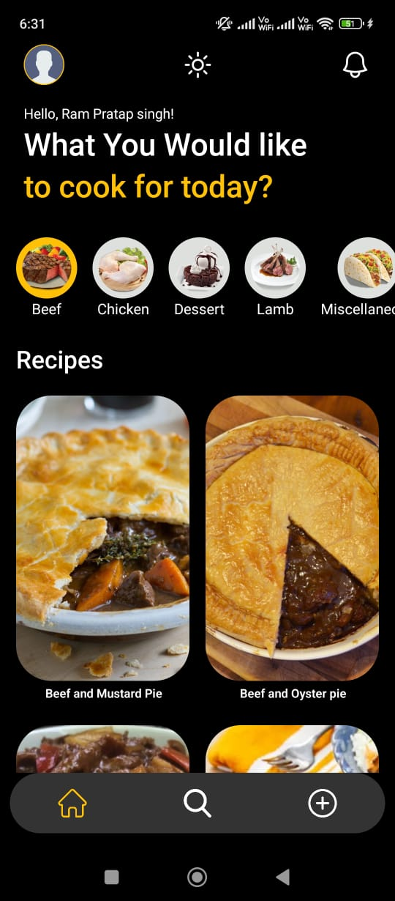
    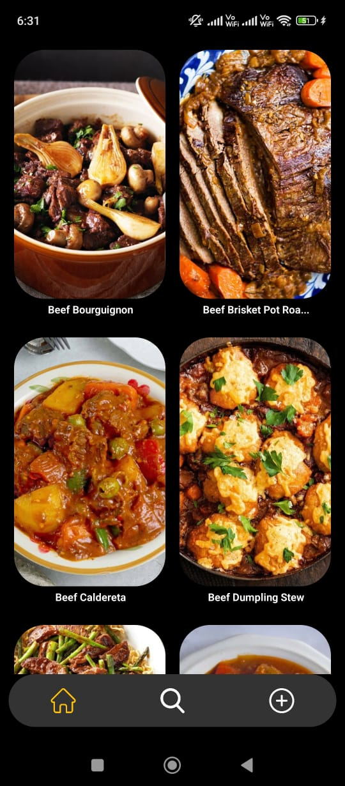
    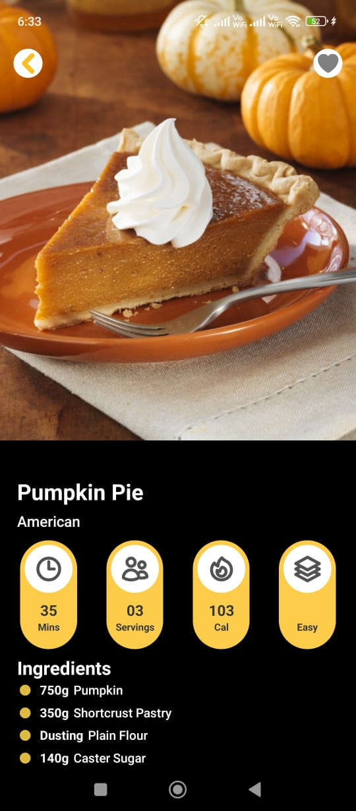
    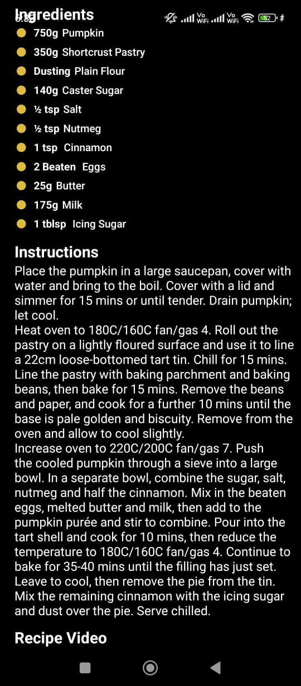
    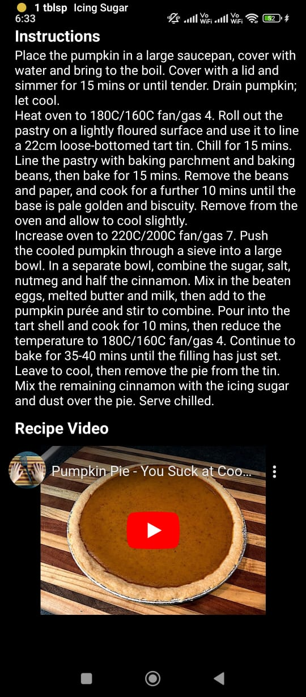
    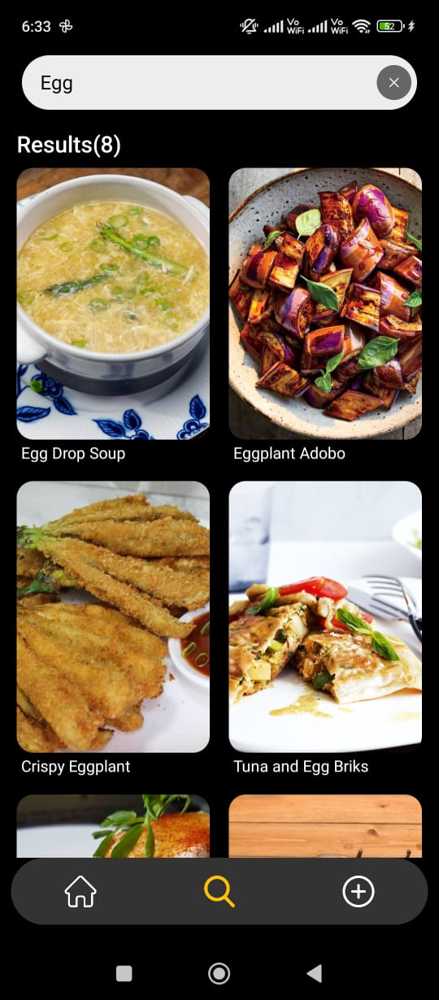
    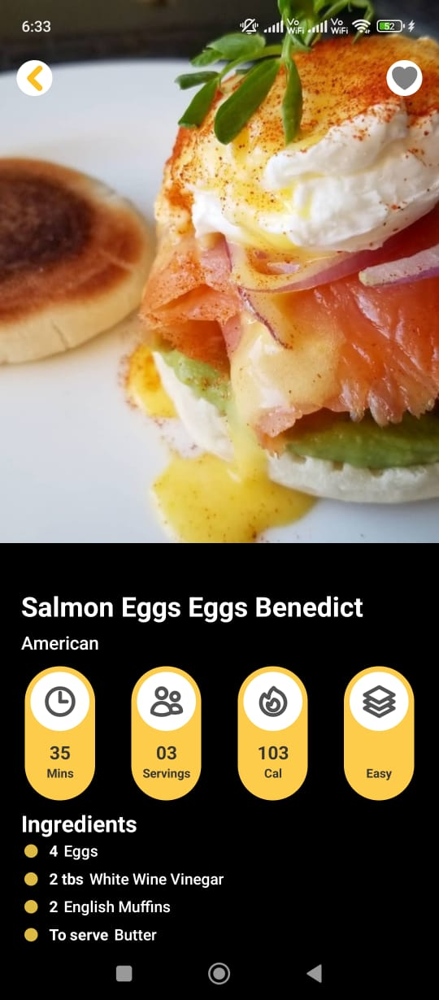
    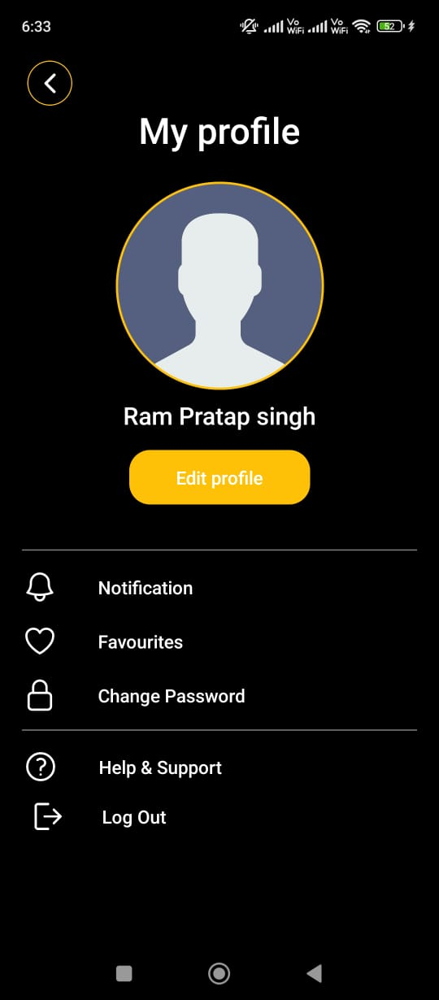

## Technologies Used
- **Frontend**: React Native (Cli)
- **Backend**: Firebase for authentication and The movie database used for recipes

## Objectives
- Provide an intuitive platform for users to discover and learn recipes effortlessly.
- Enhance user engagement with integrated video tutorials.
- Ensure secure and seamless user access with robust authentication.

## How to Run
1. Clone the repository `git clone https://github.com/Hari2855/Food_Recipe_app.git`
2. Install dependencies with `npm install` or `yarn install`.
3. Run the app with `npx react-native run-android`.

This app is designed to combine functionality and aesthetics, delivering a powerful tool for both novice and experienced cooks.
